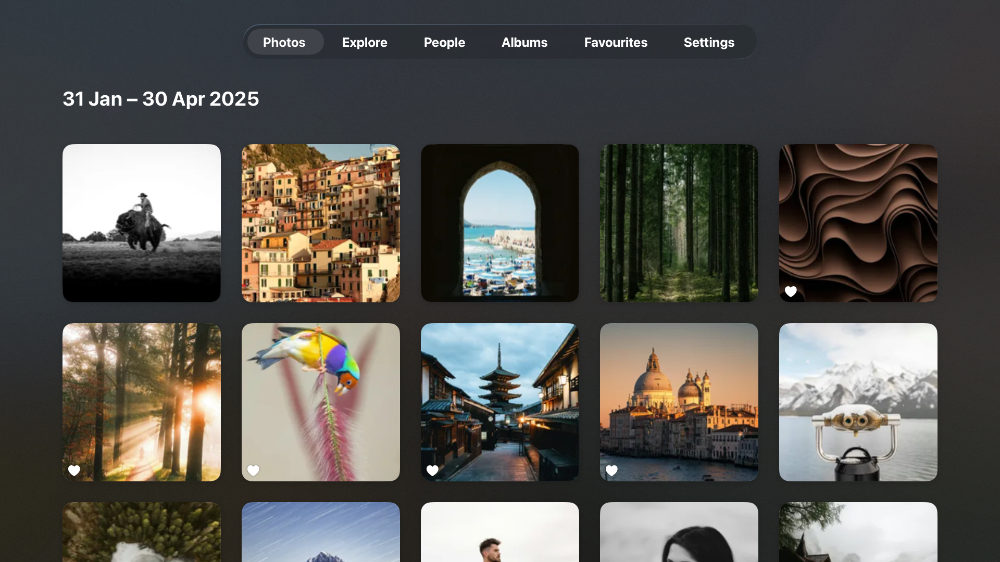
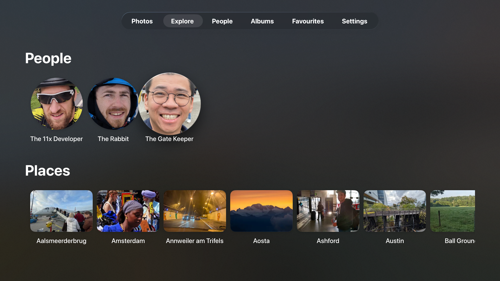
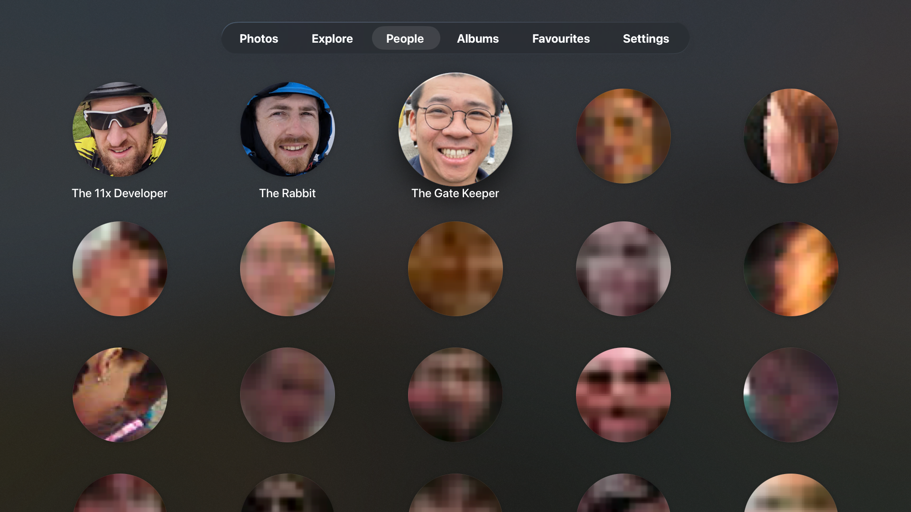
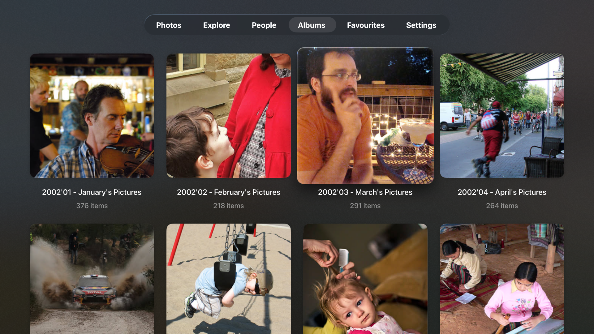
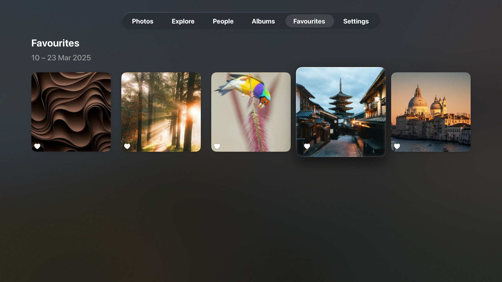

<p align="center">
  
</p>

<h1 align="center">ImmichLens</h1>

<p align="center">
  A native SwiftUI app for viewing your photos and videos on an <a href="https://immich.app/">Immich</a> server.<br>
  Primarily built for <strong>Apple TV</strong>, with <strong>macOS</strong> support.
</p>

<p align="center">
  
  
  
</p>

---

## Screenshots

<p align="center">
  
  
</p>
<p align="center">
  
  
</p>
<p align="center">
  
</p>

## Features

- **Photo & Video Timeline** — Browse your entire library in a responsive grid with time-bucket pagination
- **Explore** — Discover your library through recognized people and places
- **Albums** — View and browse your Immich albums
- **Favourites** — Quick access to your starred photos and videos
- **Full-Screen Viewer** — Swipe through photos and play videos natively
- **Secure Authentication** — Connect to your Immich server with credentials stored in Keychain

## Development

### API Client

The API client is auto-generated from the Immich OpenAPI spec using [`swift-openapi-generator`](https://github.com/apple/swift-openapi-generator) as part of the Xcode build process.

### VS Code Setup

If you prefer VS Code over Xcode for development:

1. Install the Xcode build server:
    ```
    brew install xcode-build-server
    ```
2. Install VS Code extensions: [Swift][swift] and [SweetPad][sweetpad]
3. Run `SweetPad: Generate Build Server Config` from the command palette
4. Run `SweetPad: Start Build Server` from the command palette

More on SweetPad: [docs][sweetpad-docs] | [autocomplete setup][sweetpad-autocomplete]

[swift]: https://marketplace.visualstudio.com/items?itemName=swiftlang.swift-vscode
[sweetpad]: https://marketplace.visualstudio.com/items?itemName=SweetPad.sweetpad
[sweetpad-docs]: https://sweetpad.hyzyla.dev/docs/intro
[sweetpad-autocomplete]: https://sweetpad.hyzyla.dev/docs/autocomplete

## Attribution

The tab-switch navigation fix (recreating `NavigationStack` on reactivation to work around a SwiftUI `.sidebarAdaptable` bug) was inspired by [ShelfPlayer](https://github.com/rasmuslos/ShelfPlayer)'s `NavigationStackWrapper` pattern.
